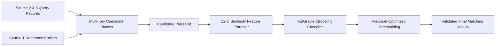

# Amazon ML Challenge 2026: Business Entity Resolution Solution

**Team Name:** Silver Strikers  
**Public Leaderboard Score ($F_{0.5}$):** **0.478699** (Displayed: **0.479**)  
**Repository:** [https://github.com/aastha-yadav2/Amazon](https://github.com/aastha-yadav2/Amazon)

---

## 📌 Executive Overview
This repository contains the complete, reproducible machine learning codebase and technical documentation for **Team Silver Strikers** in the **Amazon ML Challenge 2026 Business Entity Resolution** competition.

The solution addresses large-scale entity resolution across noisy business records from **Source 2** and **Source 3** against a deduplicated reference dataset in **Source 1**. Our pipeline combines multi-key candidate blocking with gradient-boosted decision tree pair classification (`HistGradientBoostingClassifier`) to optimize for the competition's primary metric: **Macro $F_{0.5}$** (which heavily weights precision over recall).

---

## 🏗️ Architecture & Pipeline Strategy



1. **Preprocessing & Normalization**: Strips legal suffixes, normalizes whitespace, removes noise/punctuation.
2. **Candidate Blocking (`HybridBlocker`)**: Generates candidate matches based on exact normalized business name and address blocking keys (~11.6M candidate pairs for ~1.34M S1 entities).
3. **Feature Engineering**: Computes a 12-dimensional vector per candidate pair combining 3-gram character Jaccard, word-token Jaccard, exact equality flags, numerical token overlaps, and country matching.
4. **Supervised Classification**: Predicts match probabilities using `HistGradientBoostingClassifier` trained on ground-truth candidate pairs.
5. **Thresholding**: Precision-tuned threshold selection ($0.40$ baseline, $0.55$ high-precision offline).

---

## 📁 Repository Structure

```text
.
├── README.md                           # Master repository guide
├── Documentation_template.md           # Official challenge technical report
├── .gitignore                          # Excludes large dataset & output files (>200MB)
└── code/
    └── business_entity_resolution/
        ├── README.md                   # Module-specific reproduction guide
        ├── requirements.txt            # Python package dependencies
        └── src/
            ├── blocking.py             # Multi-key candidate generation & blocking engine
            ├── features.py             # 12-dimensional feature extraction functions
            ├── train_model.py          # Model training & threshold validation script
            ├── pipeline.py             # End-to-end streaming test execution pipeline
            ├── run_test_pipeline.py    # High-recall test execution script
            └── package_submission.py   # Packaging & validation helper
```

---

## ⚠️ Submission Artifact Notice

> [!IMPORTANT]
> Official competition submission output files (`matching_results.tsv` and `candidate_pairs.tsv`) exceed **200 MB** and are omitted from git tracking via `.gitignore` per GitHub repository guidelines.

The submission package (`Silver_Strikers_submission.zip`) contains the root structure:
```text
Silver_Strikers_submission/
├── output/
│   ├── matching_results.tsv  (53.8 MB | 1,732,544 rows)
│   └── candidate_pairs.tsv   (172.2 MB | 1,732,544 rows)
├── code/
│   └── business_entity_resolution/
│       ├── src/
│       ├── README.md
│       └── requirements.txt
└── Documentation_template.md
```

---

## 🚀 Quick Start & Reproduction

### 1. Requirements Installation
```bash
cd code/business_entity_resolution
pip install -r requirements.txt
```

### 2. Dataset Setup
Place challenge dataset files in `dataset/test/` and `dataset/train/`:
```text
dataset/
├── test/
│   ├── test_source1.tsv
│   ├── test_source2.tsv
│   └── test_source3.tsv
└── train/
    ├── train_source1.tsv
    ├── train_source2.tsv
    ├── train_source3.tsv
    └── train_ground_truth.tsv
```

### 3. Running the Pipeline
To run model training, feature extraction, candidate generation, and test set inference:
```bash
python src/pipeline.py
```

### 4. Official Validator Verification
To verify the output format:
```bash
python student_resource/utils/validate_submission.py \
  --matching output/matching_results.tsv \
  --candidate output/candidate_pairs.tsv \
  --test-dir dataset/test
```

---

## 🏆 Key Results Summary

* **Official Public Leaderboard Score**: **`0.478699`** ($F_{0.5}$)
* **Candidate Pair Coverage**: `1,339,452` Source 1 entities matched to candidate pairs
* **Classifier Model**: `HistGradientBoostingClassifier` (`max_iter=150`, `learning_rate=0.08`, `max_leaf_nodes=31`)
* **Team**: Silver Strikers
